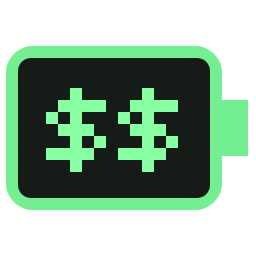

<h1 align="center">
  
  Token Dashboard
</h1>

<p align="center">
  <a href="#한국어">한국어</a> · <a href="#english">English</a>
</p>

## 한국어

Windows/macOS용 비공식 Codex 사용량 위젯입니다. 레트로 픽셀 UI로 주간 사용량과 선택적인 5시간 사용량을 표시합니다. OpenAI 공식 제품이 아닙니다.

### 다운로드 및 실행

Mac은 별도의 [macOS 프리뷰 릴리스](https://github.com/dhking1123/TokenDashboard/releases/tag/v5.1-macos)를 사용하세요. Apple Silicon용 arm64와 Intel용 x86_64로 제공하며, macOS 13 이상이 필요합니다. [Mac 설치·보안·재빌드 안내](README-macOS.md)를 먼저 읽어주세요. Apple Developer ID 서명·공증은 포함되지 않으며 실제 Mac 사용자 계정 조회는 미검증입니다.

아래는 Windows용 안내입니다.

1. [Releases](https://github.com/dhking1123/TokenDashboard/releases)에서 최신 Windows x64 ZIP을 받습니다.
2. 압축을 풀고 `CodexUsageDashboard.exe`를 실행합니다. Python 설치는 필요하지 않습니다.
3. 실행할 PC에 Codex가 설치되어 있고 본인 계정으로 로그인되어 있어야 합니다.

개인 제작·미서명 EXE이므로 Windows 보안 경고가 나타날 수 있습니다. 신뢰할 수 있는 출처인지 확인하세요.

### 사용법

- WEEK 기본 표시. 상단 토글로 5시간 영역을 추가하거나 숨깁니다.
- 일반·미니멀 모두 WEEK 또는 5H 영역을 더블클릭하면 해당 항목의 표시가 바뀝니다.
- **USED**: 사용량을 왼쪽부터 채움. **LEFT**: 잔여량을 오른쪽부터 채움.
- 잔여 100%는 체크 표시, 완전 소진은 자물쇠로 표시합니다.
- 실제 사용량 70% 이상은 노란색, 90% 이상은 빨간색입니다. 화이트 모드는 숫자에 테두리를 표시합니다.
- 상단 화살표: 일반·미니멀 전환. 오른쪽 상단 위치를 유지합니다.
- 하단 새로고침 / 테마 버튼. 자동 조회 간격은 30초입니다.
- 테마, 5H 표시 여부, 항목별 USED/LEFT 선택을 저장합니다.

설정 저장 위치:

- Windows EXE: `%LOCALAPPDATA%\CodexUsageDashboard\settings.json`
- macOS 앱: `~/Library/Application Support/TokenDashboard/settings.json`
- 소스 실행: 소스 옆 `usage-dashboard-settings.json`

### 데이터와 제한

설치된 `codex app-server`를 통해 `account/read`, `account/rateLimits/read`, `account/usage/read`를 조회합니다. 모델에 프롬프트를 보내거나 응답 생성을 요청하지 않습니다. 로그인 정보나 개인 사용 기록은 배포 파일에 포함하지 않습니다.

5시간 본 한도가 있으면 CODEX, 별도 Spark 한도를 사용하는 경우 SPARK로 구분합니다. 데이터가 없거나 조회가 실패하면 `--`로 표시합니다. TOKENS는 서버가 반환한 누적값이며 남은 구독 토큰 수가 아닙니다.

Codex 버전·계정·플랜에 따라 제공되는 데이터가 다를 수 있습니다. 내부 조회 인터페이스가 변경되면 앱 업데이트가 필요할 수 있으며, 모든 플랜·버전에서의 호환성을 보장하지 않습니다. Windows 11 x64에서 검증했습니다.

### 개발 / 재빌드

Windows, Python 3.12 기준:

```powershell
python -m pip install -r requirements.txt
python usage-dashboard.py
python test_release.py
powershell -ExecutionPolicy Bypass -File .\build.ps1
```

결과는 `dist/`에 생성됩니다. 테스트는 실제 계정 조회 없이 UI 이벤트·표시·설정을 검사합니다. 실제 로그인 상태 조회 점검은 `python usage-dashboard.py --check`입니다.

`CodexUsageDashboard.spec`는 외부 프로그램의 DLL이 섞이지 않도록 빌드 경로를 제한하고 Qt와 호환되는 VC 런타임을 포함합니다.

Mac에서는 Python 3.12와 Xcode Command Line Tools를 준비한 뒤 저장소 루트에서 실행합니다.

```bash
python3 -m pip install -r requirements.txt
bash build-macos.sh
```

Intel과 Apple Silicon용 앱은 각각 해당 CPU의 Mac 환경에서 빌드합니다. Mac 빌드·UI 회귀·패키지 실행 테스트는 GitHub의 macOS 러너에서 수행하며, 실제 사용자 계정 조회와 Apple 공증은 포함하지 않습니다.

### 구성

- `usage-dashboard.py`: 조회 및 UI
- `CodexUsageDashboard.spec`, `build.ps1`, `requirements.txt`: EXE 재빌드
- `TokenDashboard-macOS.spec`, `build-macos.sh`: macOS 앱 재빌드
- `.github/workflows/macos-release.yml`: Intel / Apple Silicon 빌드 및 검사
- `test_release.py`: 회귀 테스트
- `battery.ico`, `battery.png`: 배터리 아이콘
- `THIRD_PARTY.txt` 및 라이선스 문서: 포함 라이브러리 안내

공유할 때는 라이선스 안내와 재빌드용 소스가 포함된 ZIP 사용을 권장합니다.

---

## English

An unofficial Codex usage widget for Windows and macOS. Its retro pixel UI shows weekly usage and an optional five-hour quota. This is not an official OpenAI product.

### Download and run

For Mac, use the separate [macOS preview release](https://github.com/dhking1123/TokenDashboard/releases/tag/v5.1-macos): **arm64** for Apple Silicon or **x86_64** for Intel. macOS 13 or later is required. Extract the ZIP, move `TokenDashboard.app` to Applications, and open it. Python is not required. Codex must be installed and signed in to your own account.

The Mac app has an ad-hoc signature only, **not an Apple Developer ID signature or notarization**. macOS may block its first launch. Only if you trust the download, approve this specific app in System Settings → Privacy & Security. Do not disable system-wide security. Actual usage retrieval with a Mac user's account has not yet been verified. Additional [Mac instructions](README-macOS.md) are available in Korean.

For Windows:

1. Download the latest Windows x64 ZIP from [Releases](https://github.com/dhking1123/TokenDashboard/releases).
2. Extract it and run `CodexUsageDashboard.exe`. Python is not required.
3. Codex must be installed on that PC and signed in to your own account.

The Windows EXE is unsigned, so Windows may show a security warning. Verify that the download comes from a trusted source.

### Controls

- WEEK is shown by default. Use the header toggle to show or hide the five-hour section.
- Double-click the WEEK or 5H area in either normal or minimal mode to switch that section's display.
- **USED** fills from the left with usage. **LEFT** fills from the right with remaining capacity.
- A check mark represents 100% remaining; a lock represents a fully exhausted quota.
- Warning colors always follow actual usage: yellow at 70% or above, red at 90% or above. Light mode adds an outline to the numbers.
- The header arrows switch between normal and minimal mode, keeping the top-right corner anchored.
- The footer buttons refresh data and switch themes. Automatic refresh runs every 30 seconds.
- Theme, five-hour visibility, and each section's USED/LEFT choice are saved.

Settings locations:

- Windows EXE: `%LOCALAPPDATA%\CodexUsageDashboard\settings.json`
- macOS app: `~/Library/Application Support/TokenDashboard/settings.json`
- Running from source: `usage-dashboard-settings.json` beside the script

### Data and limitations

The widget queries `account/read`, `account/rateLimits/read`, and `account/usage/read` through the installed `codex app-server`. It does not send model prompts or request generated responses. The distribution contains no sign-in credentials or personal usage history.

If a main five-hour quota is available, it is labeled CODEX; a separate Spark quota is labeled SPARK. Missing data or failed queries display `--`. TOKENS is the cumulative value returned by the server, not the number of subscription tokens remaining.

Available data can vary by Codex version, account, and plan. Changes to the internal query interface may require an app update; compatibility with every plan and version is not guaranteed. The Windows app was verified on Windows 11 x64. Mac builds, UI regression tests, and packaged-app launch tests run on GitHub's macOS runners; actual Mac account queries and Apple notarization are not included.

When launched from Finder, the Mac app also checks common Codex app, Homebrew, and local CLI locations because Finder may not inherit your terminal's PATH. For a custom CLI location, launch the app's internal executable from a terminal with the appropriate PATH, or install Codex in a standard location.

### Development and rebuilding

On Windows with Python 3.12:

```powershell
python -m pip install -r requirements.txt
python usage-dashboard.py
python test_release.py
powershell -ExecutionPolicy Bypass -File .\build.ps1
```

Output is written to `dist/`. Tests check UI events, rendering, and settings without querying a real account. To check live usage retrieval, run `python usage-dashboard.py --check`.

`CodexUsageDashboard.spec` restricts build-time DLL search paths to avoid collecting unrelated libraries and includes a Qt-compatible VC runtime.

On Mac, install Python 3.12 and Xcode Command Line Tools, then run from the repository root:

```bash
python3 -m pip install -r requirements.txt
bash build-macos.sh
```

Build Intel and Apple Silicon apps on Macs with the corresponding CPU architecture.

### Repository layout

- `usage-dashboard.py`: usage queries and UI
- `CodexUsageDashboard.spec`, `build.ps1`, `requirements.txt`: Windows EXE build
- `TokenDashboard-macOS.spec`, `build-macos.sh`: macOS app build
- `.github/workflows/macos-release.yml`: Intel / Apple Silicon builds and checks
- `test_release.py`: regression tests
- `battery.ico`, `battery.png`: battery icons
- `THIRD_PARTY.txt` and license documents: bundled library notices

When sharing the app, use the ZIP containing the license notices and rebuildable source.
