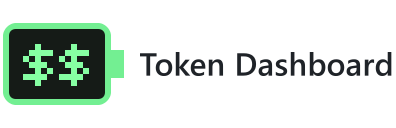

<a name="token-dashboard"></a>
<h1 align="center">
  
</h1>

<p align="center">
  <samp>YOUR CODEX USAGE. ONE LITTLE TERMINAL.</samp>
</p>

<p align="center">
  <a href="#한국어">한국어</a> ·
  <a href="#english">English</a> ·
  <a href="https://github.com/dhking1123/TokenDashboard/releases/tag/v5">Windows</a> ·
  <a href="https://github.com/dhking1123/TokenDashboard/releases/tag/v5.1-macos">macOS</a>
</p>

```text
┌──────────────────────────────────────────────────────────┐
│  TOKEN DASHBOARD                         SYSTEM OVERVIEW │
├──────────────────────────────────────────────────────────┤
│  DISPLAY     RETRO PIXELS / DARK & LIGHT                 │
│  MONITOR     WEEKLY + OPTIONAL 5-HOUR QUOTA              │
│  REFRESH     EVERY 30 SECONDS                            │
│  INPUT       YOUR EXISTING CODEX SIGN-IN                 │
│  OUTPUT      USAGE INFO / NO MODEL GENERATION            │
└──────────────────────────────────────────────────────────┘
```

<p align="center">
  <sub>Unofficial utility · Not affiliated with OpenAI · No credentials bundled</sub>
</p>

---

## 한국어

### `C:\TOKEN> ABOUT`

**사용량은 한눈에. 화면은 작은 터미널처럼.**

Codex 사용량을 보여주는 Windows/macOS용 비공식 데스크톱 위젯입니다. 주간 사용량을 기본으로 표시하고, 필요할 때만 5시간 영역을 펼칩니다. OpenAI 공식 제품이 아닙니다.

### `C:\TOKEN> DOWNLOAD`

| 시스템 | 받을 파일 | 배포 상태 |
| :--- | :--- | :--- |
| Windows · x64 | [Windows ZIP 받기](https://github.com/dhking1123/TokenDashboard/releases/download/v5/CodexUsageDashboard-Windows-x64.zip) | v5 |
| Mac · Apple Silicon | [arm64 ZIP 받기](https://github.com/dhking1123/TokenDashboard/releases/download/v5.1-macos/TokenDashboard-macOS-arm64.zip) | v5.1 |
| Mac · Intel | [x86_64 ZIP 받기](https://github.com/dhking1123/TokenDashboard/releases/download/v5.1-macos/TokenDashboard-macOS-x86_64.zip) | v5.1 |

**압축 해제 → 앱 실행 → 사용량 확인.** Python 설치는 필요하지 않습니다. 실행할 기기에 Codex가 설치되어 있고 본인 계정으로 로그인되어 있어야 합니다.

- **Windows:** `CodexUsageDashboard.exe`를 실행합니다.
- **Mac:** macOS 13 이상. `TokenDashboard.app`을 응용 프로그램 폴더로 옮겨 실행합니다.

> **SYSTEM NOTICE**
>
> Windows EXE는 미서명입니다. Mac 앱은 ad-hoc 서명만 있으며 Apple Developer ID 서명·공증은 없습니다. 첫 실행 시 보안 경고나 차단이 발생할 수 있습니다. 출처를 확인하고 신뢰할 때만 해당 앱을 개별 승인하세요. 시스템 전체 보안 설정은 끄지 마세요.
>
> Mac은 빌드·UI·패키지 실행 테스트를 통과했지만 **실제 Mac 사용자 계정의 사용량 조회는 미검증**입니다. [Mac 상세 안내](docs/macOS.md)

### `C:\TOKEN> CONTROLS`

```text
                   SAME QUOTA / TWO VIEWS

  USED   78%    [████████████████░░░░]    FILLS FROM LEFT
                         ⇅
                    DOUBLE-CLICK
                         ⇅
  LEFT   22%    [░░░░░░░░░░░░░░░░████]    FILLS FROM RIGHT

              ILLUSTRATION — NOT LIVE DATA
```

| 조작 | 동작 |
| :--- | :--- |
| WEEK / 5H 영역 더블클릭 | 해당 항목의 사용량 `USED` ↔ 잔여량 `LEFT` 전환 |
| 상단 토글 | 5시간 영역 표시 / 숨김. 창 높이만 변경 |
| 상단 화살표 | 일반 / 미니멀 전환. 오른쪽 상단 위치 유지 |
| 상단 `-` / `X` | 최소화 / 종료 |
| 하단 새로고침 | 즉시 조회. 자동 조회는 30초마다 |
| 하단 테마 버튼 | 다크 / 화이트 전환 |

일반·미니멀 모드 모두 같은 조작을 지원합니다. 테마, 5H 표시 여부와 항목별 USED/LEFT 선택을 저장합니다.

**표시 읽는 법**

- 🟩 실제 사용량 **70% 미만** → 기본 녹색
- 🟨 실제 사용량 **70% 이상** → 노란색 경고
- 🟥 실제 사용량 **90% 이상** → 빨간색 경고
- `✓` → 잔여량 보기에서 **100% 사용 가능**
- 자물쇠 → **해당 한도 모두 소진**
- `--` → 데이터 없음 또는 조회 실패

경고 색상은 잔여량 보기에서도 **실제 사용량 기준**입니다. 화이트 모드에서는 숫자 테두리로 가독성을 높였습니다.

### `C:\TOKEN> DATA / PRIVACY`

**조회만 합니다. 모델에 질문하지 않습니다.**

설치된 `codex app-server`의 `account/read`, `account/rateLimits/read`, `account/usage/read`를 조회합니다. 모델 응답 생성은 요청하지 않으며, 배포 파일에 로그인 정보나 개인 사용 기록을 넣지 않습니다.

5시간 본 한도가 있으면 **CODEX**, 별도 Spark 한도이면 **SPARK**로 구분합니다. **TOKENS는 서버가 반환한 누적값**이며 남은 구독 토큰 수가 아닙니다. Codex 버전·계정·플랜에 따라 제공 데이터가 달라질 수 있고, 내부 인터페이스 변경 시 앱 업데이트가 필요할 수 있습니다.

<details>
<summary><b>[+] 설정 저장 위치</b></summary>

| 실행 방식 | 경로 |
| :--- | :--- |
| Windows EXE | `%LOCALAPPDATA%\CodexUsageDashboard\settings.json` |
| macOS 앱 | `~/Library/Application Support/TokenDashboard/settings.json` |
| 소스 실행 | 저장소 루트의 `usage-dashboard-settings.json` |

</details>

<details>
<summary><b>[+] 개발 / 재빌드 / 파일 구성</b></summary>

**Windows · Python 3.12**

```powershell
python -m pip install -r requirements.txt
python src/usage-dashboard.py
python tests/test_release.py
python tests/test_rpc.py
powershell -ExecutionPolicy Bypass -File .\scripts\build.ps1
```

**macOS · Python 3.12 + Xcode Command Line Tools**

```bash
python3 -m pip install -r requirements.txt
bash scripts/build-macos.sh
```

저장소 루트에서 실행하면 `dist/`에 결과가 생성됩니다. Mac은 Intel / Apple Silicon 각각 해당 CPU 환경에서 빌드합니다.

테스트는 계정 조회 없이 UI 이벤트·표시·설정·통신 처리를 검사합니다. 실제 계정 조회 점검은 `python src/usage-dashboard.py --check`입니다. Git으로 복제한 저장소에서는 `python scripts/benchmark_render.py`로 렌더링 성능을 확인할 수 있습니다(배포 ZIP에는 Git 이력이 없습니다). Windows는 Windows 11 x64에서, Mac은 GitHub macOS 러너에서 UI 및 패키지 실행을 검사했습니다. 모든 계정·플랜·버전의 호환성을 보장하지 않습니다.

```text
TokenDashboard/
├── src/                       application source
│   └── usage-dashboard.py
├── tests/                     UI + RPC regression tests
├── scripts/                   builds + rendering benchmark
├── packaging/                 Windows + macOS bundle specs
├── assets/                    icons
├── licenses/                  library notices + licenses
├── docs/                      changelog + macOS instructions
├── .github/workflows/         macOS build checks
├── README.md                  this guide
├── requirements.txt           pinned dependencies
└── build/ + dist/              generated output (gitignored)
```

Windows 빌드 설정은 다른 프로그램의 DLL이 섞이지 않도록 검색 경로를 제한하고 Qt와 호환되는 VC 런타임을 포함합니다. Mac에서 Codex를 찾지 못하면 [경로 및 실행 안내](docs/macOS.md)를 확인하세요.

</details>

공유할 때는 **라이선스 안내와 재빌드용 소스가 포함된 ZIP**을 전달해주세요.

---

## English

### `C:\TOKEN> ABOUT`

**Your usage at a glance. A little terminal on your desktop.**

An unofficial Codex usage widget for Windows and macOS. Weekly usage is always visible; expand the five-hour section only when you need it. This is not an official OpenAI product.

### `C:\TOKEN> DOWNLOAD`

| System | Download | Release |
| :--- | :--- | :--- |
| Windows · x64 | [Windows ZIP](https://github.com/dhking1123/TokenDashboard/releases/download/v5/CodexUsageDashboard-Windows-x64.zip) | v5 |
| Mac · Apple Silicon | [arm64 ZIP](https://github.com/dhking1123/TokenDashboard/releases/download/v5.1-macos/TokenDashboard-macOS-arm64.zip) | v5.1 |
| Mac · Intel | [x86_64 ZIP](https://github.com/dhking1123/TokenDashboard/releases/download/v5.1-macos/TokenDashboard-macOS-x86_64.zip) | v5.1 |

**Extract → launch → check your usage.** No Python installation required. Codex must be installed and signed in to your own account on that device.

- **Windows:** run `CodexUsageDashboard.exe`.
- **Mac:** macOS 13 or later. Move `TokenDashboard.app` to Applications and open it.

> **SYSTEM NOTICE**
>
> The Windows EXE is unsigned. The Mac app has an ad-hoc signature only, without Apple Developer ID signing or notarization. Your system may warn or block the first launch. Verify the source and approve only this specific app if you trust it. Do not disable system-wide security.
>
> Mac build, UI, and packaged-app launch tests passed. **Actual usage retrieval with a Mac user's account remains unverified.** Additional [Mac instructions](docs/macOS.md) are available in Korean.

### `C:\TOKEN> CONTROLS`

```text
                   SAME QUOTA / TWO VIEWS

  USED   78%    [████████████████░░░░]    FILLS FROM LEFT
                         ⇅
                    DOUBLE-CLICK
                         ⇅
  LEFT   22%    [░░░░░░░░░░░░░░░░████]    FILLS FROM RIGHT

              ILLUSTRATION — NOT LIVE DATA
```

| Input | Action |
| :--- | :--- |
| Double-click WEEK / 5H | Switch that section between `USED` and `LEFT` |
| Header toggle | Show / hide the five-hour section; only height changes |
| Header arrows | Switch normal / minimal mode; keep the top-right anchor |
| Header `-` / `X` | Minimize / close |
| Footer refresh | Query now; automatic refresh runs every 30 seconds |
| Footer theme button | Switch dark / light mode |

Both normal and minimal modes share these controls. Theme, five-hour visibility, and each section's USED/LEFT choice are saved.

**Reading the display**

- 🟩 Actual usage **below 70%** → green
- 🟨 Actual usage **70% or above** → yellow warning
- 🟥 Actual usage **90% or above** → red warning
- `✓` → **100% available**, when viewing remaining capacity
- Lock → **quota fully exhausted**
- `--` → missing data or failed query

Warning colors always follow **actual usage**, even in LEFT mode. Light mode outlines the numbers for readability.

### `C:\TOKEN> DATA / PRIVACY`

**Queries only. No model prompts.**

The widget calls `account/read`, `account/rateLimits/read`, and `account/usage/read` through the installed `codex app-server`. It does not request generated model responses. Downloads contain no sign-in credentials or personal usage history.

A main five-hour quota is labeled **CODEX**; a separate Spark quota is labeled **SPARK**. **TOKENS is the cumulative value returned by the server**, not remaining subscription tokens. Available data depends on the Codex version, account, and plan. Changes to internal interfaces may require an app update.

<details>
<summary><b>[+] Settings locations</b></summary>

| Runtime | Path |
| :--- | :--- |
| Windows EXE | `%LOCALAPPDATA%\CodexUsageDashboard\settings.json` |
| macOS app | `~/Library/Application Support/TokenDashboard/settings.json` |
| Source | `usage-dashboard-settings.json` in the repository root |

</details>

<details>
<summary><b>[+] Development / rebuilding / repository layout</b></summary>

**Windows · Python 3.12**

```powershell
python -m pip install -r requirements.txt
python src/usage-dashboard.py
python tests/test_release.py
python tests/test_rpc.py
powershell -ExecutionPolicy Bypass -File .\scripts\build.ps1
```

**macOS · Python 3.12 + Xcode Command Line Tools**

```bash
python3 -m pip install -r requirements.txt
bash scripts/build-macos.sh
```

Run from the repository root. Output is written to `dist/`. Build Intel and Apple Silicon apps on Macs with the matching CPU architecture.

Tests check UI events, rendering, settings, and RPC handling without querying an account. For live usage retrieval, run `python src/usage-dashboard.py --check`. In a Git clone, measure rendering performance with `python scripts/benchmark_render.py` (release ZIPs do not include Git history). Windows was verified on Windows 11 x64; Mac UI and package-launch checks run on GitHub macOS runners. Compatibility with every account, plan, and version is not guaranteed.

```text
TokenDashboard/
├── src/                       application source
│   └── usage-dashboard.py
├── tests/                     UI + RPC regression tests
├── scripts/                   builds + rendering benchmark
├── packaging/                 Windows + macOS bundle specs
├── assets/                    icons
├── licenses/                  library notices + licenses
├── docs/                      changelog + macOS instructions
├── .github/workflows/         macOS build checks
├── README.md                  this guide
├── requirements.txt           pinned dependencies
└── build/ + dist/              generated output (gitignored)
```

The Windows build restricts DLL search paths and includes a Qt-compatible VC runtime. On Mac, Finder may not inherit your terminal's PATH. The app also checks standard Codex app, Homebrew, and local CLI locations. For a custom CLI installation, launch the app's internal executable from a terminal with the appropriate PATH or install Codex in a standard location.

</details>

When sharing, use the **ZIP containing library notices and rebuildable source**.

---

<p align="center">
  <samp>END OF README · THANK YOU FOR USING TOKEN DASHBOARD</samp><br>
  <a href="#token-dashboard">↑ BACK TO TOP</a>
</p>
